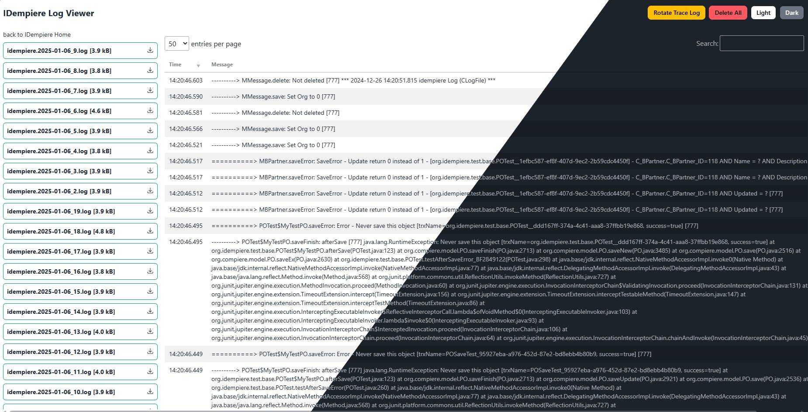

# iDempiere Log Viewer

iDempiere Log Viewer is a tool designed to help you easily view and analyze logs generated by the iDempiere ERP system.

## Features

- **Download logs**: Download logs for keeping on local.
- **Delete Logs**: Delete logs for saving some spaces.
- **Rotate logs**: Create new log file for easy monitoring.
- **Configurable** : Change file size limit for large file log to prevent load the content.

## Installation

To install the iDempiere Log Viewer, follow these steps:

1. Download latest jar on [releases](https://github.com/uthadehikaru/idempiere-log-viewer/releases)
2. Install via Felix Console

## Usage

Access to <idempiere url>/log-viewer

## Configuration

create new System Configurator with name "LOG_VIEWER_LIMIT_SIZE" and set configured value on bytes.
default LOG_VIEWER_LIMIT_SIZE is 50000000 (50MB)

## Contributing

We welcome contributions to the iDempiere Log Viewer project. To contribute, please follow these steps:

1. Fork the repository.
2. Create a new branch for your feature or bugfix.
3. Commit your changes and push them to your fork.
4. Submit a pull request with a description of your changes.

## Contact

For any questions or feedback, please open an issue on the [GitHub repository](https://github.com/uthadehikaru/idempiere-log-viewer).
